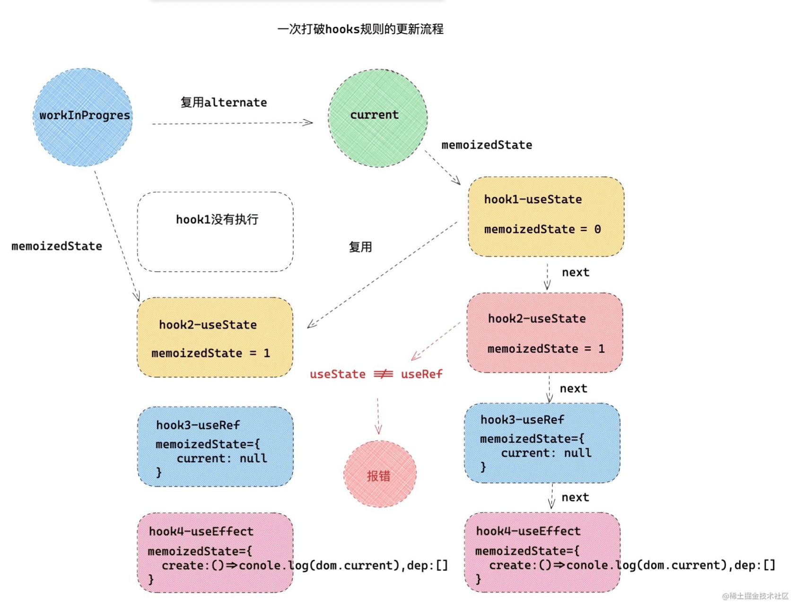

# Hooks 原理

## Hooks 出现本质上原因是

* 让函数组件也能做类组件的事，有自己的状态，可以处理一些副作用，能获取 ref ，也能做数据缓存。
* 解决逻辑复用难的问题。
* 放弃面向对象编程，拥抱函数式编程。

## hooks 对象本质上是主要以三种处理策略存在 React 中

* ContextOnlyDispatcher： 第一种形态是防止开发者在函数组件外部调用 hooks ，所以第一种就是报错形态，只要开发者调用了这个形态下的 hooks ，就会抛出异常。
* HooksDispatcherOnMount： 第二种形态是函数组件初始化 mount ，因为之前讲过 hooks 是函数组件和对应 fiber 桥梁，这个时候的 hooks 作用就是建立这个桥梁，初次建立其 hooks 与 fiber 之间的关系。
* HooksDispatcherOnUpdate：第三种形态是函数组件的更新，既然与 fiber 之间的桥已经建好了，那么组件再更新，就需要 hooks 去获取或者更新维护状态。

## React Hooks 为什么不能写在条件语句中？

因为在更新过程中，如果通过 if 条件语句，增加或者删除 hooks，在复用 hooks 过程中，会产生复用 hooks 状态和当前 hooks 不一致的问题。
举一个例子

``` tsx
export default function Index({ showNumber }){
    let number, setNumber
    showNumber && ([ number,setNumber ] = React.useState(0)) // 第一个hooks
}
```

第一次渲染时候 showNumber = true 那么第一个 hooks 会渲染，第二次渲染时候，父组件将 showNumber 设置为 false ，那么第一个 hooks 将不执行，那么更新逻辑会变成这样。

* hook复用顺序 缓存的老hooks 新的hooks
* 第一次hook复用 useState useState
* 第二次hook复用 useState useRef


第二次复用时候已经发现 hooks 类型不同 useState !== useRef ，那么已经直接报错了。所以开发的时候一定注意 hooks 顺序一致性。

## 状态派发

useState 解决了函数组件没有 state 的问题，让无状态组件有了自己的状态，useState 在 state 章节已经说了基本使用，接下来重点介绍原理使用， useState 和 useReducer 原理大同小异，本质上都是触发更新的函数都是 dispatchAction。

``` tsx
const [ number,setNumber ] = React.useState(0)  
```

setNumber 本质就是 dispatchAction 。首先需要看一下执行 useState(0) 本质上做了些什么？

``` tsx
// react-reconciler/src/ReactFiberHooks.js
function mountState(initialState){
     const hook = mountWorkInProgressHook();
    if (typeof initialState === 'function') {initialState = initialState() } // 如果 useState 第一个参数为函数，执行函数得到初始化state
     hook.memoizedState = hook.baseState = initialState;
    const queue = (hook.queue = { ... }); // 负责记录更新的各种状态。
    const dispatch = (queue.dispatch = (dispatchAction.bind(  null,currentlyRenderingFiber,queue, ))) // dispatchAction 为更新调度的主要函数
    return [hook.memoizedState, dispatch];
}

```

* 上面的 state 会被当前 hooks 的 memoizedState 保存下来，每一个 useState 都会创建一个 queue 里面保存了更新的信息。
* 每一个 useState 都会创建一个更新函数，比如如上的 setNumber 本质上就是 dispatchAction，那么值得注意一点是，当前的 fiber 被 bind 绑定了固定的参数传入 dispatchAction 和 queue ，所以当用户触发 setNumber 的时候，能够直观反映出来自哪个 fiber 的更新。
* 最后把 memoizedState dispatch 返回给开发者使用。

### dispatchAction

``` tsx

function dispatchAction(fiber, queue, action){
    /*第一步：创建一个 update*/
    const update = { ... }
    const pending = queue.pending;
    if (pending === null) {  /*第一个待更新任务*/
        update.next = update;
    } else {  /*已经有带更新任务*/
       update.next = pending.next;
       pending.next = update;
    }
    if( fiber === currentlyRenderingFiber ){
        /*说明当前fiber正在发生调和渲染更新，那么不需要更新*/
    }else{
       if(fiber.expirationTime === NoWork && (alternate === null || alternate.expirationTime === NoWork)){
            const lastRenderedReducer = queue.lastRenderedReducer;
            const currentState = queue.lastRenderedState;                 /*上一次的state*/
            const eagerState = lastRenderedReducer(currentState, action); /*这一次新的state*/
            if (is(eagerState, currentState)) {                           /*如果每一个都改变相同的state，那么组件不更新*/
               return
            }
       }
       scheduleUpdateOnFiber(fiber, expirationTime);    /*发起调度更新*/
    }
}

```

* 首先用户每一次调用 dispatchAction（比如如上触发 setNumber ）都会先创建一个 update ，然后把它放入待更新 pending 队列中。
* 然后判断如果当前的 fiber 正在更新，那么也就不需要再更新了。
* 反之，说明当前 fiber 没有更新任务，那么会拿出上一次 state 和 这一次 state 进行对比，如果相同，那么直接退出更新。如果不相同，那么发起更新调度任务。这就解释了，为什么函数组件 useState 改变相同的值，组件不更新了。

## 处理副作用

### 初始化

在 render 阶段，实际没有进行真正的 DOM 元素的增加，删除，React 把想要做的不同操作打成不同的 effectTag ，等到commit 阶段，统一处理这些副作用，包括 DOM 元素增删改，执行一些生命周期等。hooks 中的 useEffect 和 useLayoutEffect 也是副作用，接下来以 effect 为例子，看一下 React 是如何处理 useEffect 副作用的。

``` tsx
function mountEffect(create,deps){
    const hook = mountWorkInProgressHook();
    const nextDeps = deps === undefined ? null : deps;
    currentlyRenderingFiber.effectTag |= UpdateEffect | PassiveEffect;
    hook.memoizedState = pushEffect(
      HookHasEffect | hookEffectTag,
      create, // useEffect 第一次参数，就是副作用函数
      undefined,
      nextDeps, // useEffect 第二次参数，deps
    )
}
```

* mountWorkInProgressHook 产生一个 hooks ，并和 fiber 建立起关系。
* 通过 pushEffect 创建一个 effect，并保存到当前 hooks 的 memoizedState 属性下。
* pushEffect 除了创建一个 effect ， 还有一个重要作用，就是如果存在多个 effect 或者 layoutEffect 会形成一个副作用链表，绑定在函数组件 fiber 的 updateQueue 上。

为什么 React 会这么设计呢，首先对于类组件有componentDidMount/componentDidUpdate 固定的生命周期钩子，用于执行初始化/更新的副作用逻辑，但是对于函数组件，可能存在多个 useEffect/useLayoutEffect ，hooks 把这些 effect，独立形成链表结构，在 commit 阶段统一处理和执行。

## useEffect和useLayoutEffect区别

### useEffect

render结束后,你的callback函数执行,但是不会block browser painting,算是某种异步的方式吧,但是class的componentDidMount 和componentDidUpdate是同步的,在render结束后就运行,useEffect在大部分场景下都比class的方式性能更好.

### useLayoutEffect

这个是用在处理DOM的时候,当你的useEffect里面的操作需要处理DOM,并且会改变页面的样式,就需要用这个,否则可能会出现出现闪屏问题, useLayoutEffect里面的callback函数会在DOM更新完成后立即执行,但是会在浏览器进行任何绘制之前运行完成,阻塞了浏览器的绘制.

## 状态获取与状态缓存

## ref 处理

在 ref 章节详细介绍过，useRef 就是创建并维护一个 ref 原始对象。用于获取原生 DOM 或者组件实例，或者保存一些状态等。

### ref 创建

``` tsx
function mountRef(initialValue) {
  const hook = mountWorkInProgressHook();
  const ref = {current: initialValue};
  hook.memoizedState = ref; // 创建ref对象。
  return ref;
}
```

### ref 更新

``` tsx
function updateRef(initialValue){
  const hook = updateWorkInProgressHook()
  return hook.memoizedState // 取出复用ref对象。
}
```

如上 ref 创建和更新过程，就是 ref 对象的创建和复用过程。

## useMemo的处理

### useMemo 创建

``` tsx
function mountMemo(nextCreate,deps){
  const hook = mountWorkInProgressHook();
  const nextDeps = deps === undefined ? null : deps;
  const nextValue = nextCreate();
  hook.memoizedState = [nextValue, nextDeps];
  return nextValue;
}
```

* useMemo 初始化会执行第一个函数得到想要缓存的值，将值缓存到 hook 的 memoizedState 上。

### useMemo 更新

``` tsx
function updateMemo(nextCreate,nextDeps){
    const hook = updateWorkInProgressHook();
    const prevState = hook.memoizedState;
    const prevDeps = prevState[1]; // 之前保存的 deps 值
    if (areHookInputsEqual(nextDeps, prevDeps)) { //判断两次 deps 值
        return prevState[0];
    }
    const nextValue = nextCreate(); // 如果deps，发生改变，重新执行
    hook.memoizedState = [nextValue, nextDeps];
    return nextValue;
}
```

* useMemo 更新流程就是对比两次的 dep 是否发生变化，如果没有发生变化，直接返回缓存值，如果发生变化，执行第一个参数函数，重新生成缓存值，缓存下来，供开发者使用。
